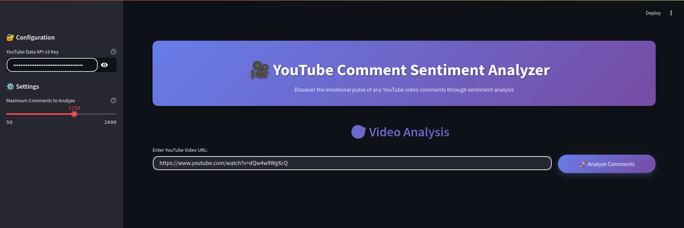
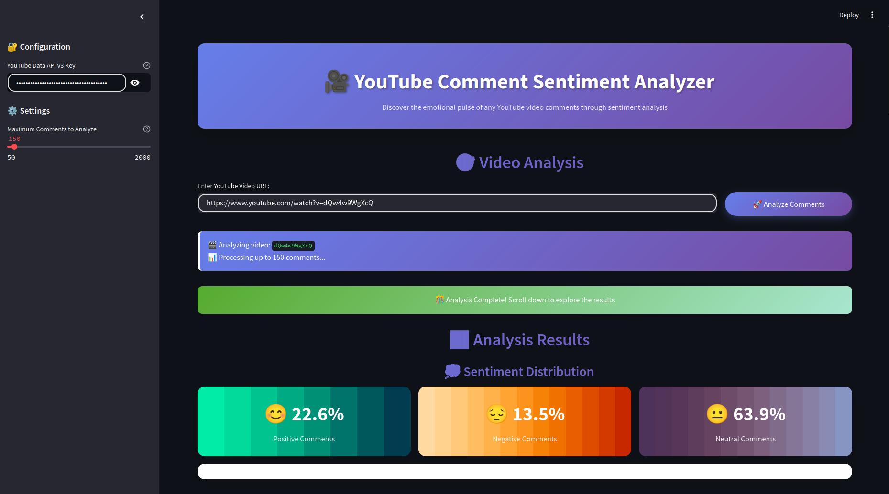
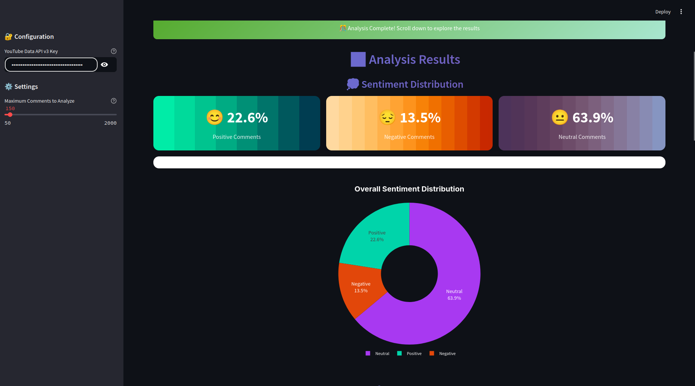
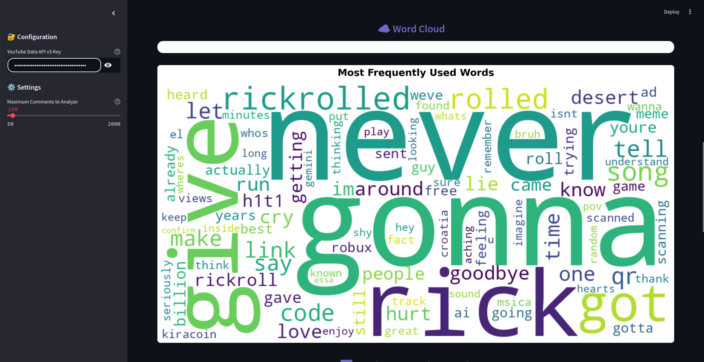
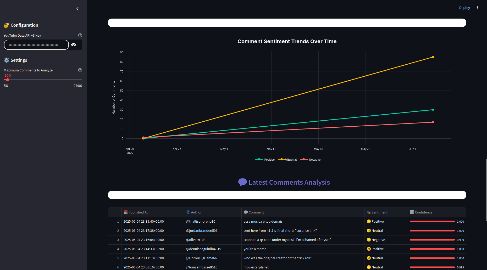

# YouTube Comment Sentiment Analysis

This project provides a complete pipeline for fetching, cleaning, and analyzing the sentiment of YouTube comments, with a focus on Indian and Hinglish content. It leverages modern NLP models and provides a Streamlit-based dashboard for interactive exploration.

---

## Features

- **YouTube Comment Fetching:**  
  Fetches comments from YouTube videos using the YouTube Data API.

- **Preprocessing:**  
  Cleans and normalizes comments, removes stopwords (supports English, Hindi, and Hinglish), and handles emojis, URLs, and special characters.

- **Sentiment Analysis:**  
  Supports sentiment analysis models:
  - `ganeshkharad/gk-hinglish-sentiment`

- **Visualization:**  
  Interactive dashboard built with Streamlit for visualizing sentiment distribution, word clouds, and more.

- **Batch Processing:**  
  Efficient batch inference for large datasets.

---

## Directory Structure

```
prime-gamer-youtube_comments_sentiment_analysis/
├── app.py                      # Streamlit dashboard
├── requirements.txt            # Python dependencies
├── screenshots/                # Screenshots for documentation
├── raw_files_not_to_use/       # EDA and experimental scripts
│   ├── eda.py
│   ├── example_fetch.py
│   └── example_request.jsonc
└── src/                        # Core modules
    ├── comment_fetcher.py
    ├── main.py
    ├── preprocessing.py
    └── sentiment_analyzer.py
```

---

## Quickstart

1. **Clone the repository:**
   ```bash
   git clone <repo-url>
   cd prime-gamer-youtube_comments_sentiment_analysis
   ```

2. **Install dependencies:**
   ```bash
   pip install -r requirements.txt
   ```

3. **Set up API keys:**
   - Place your YouTube Data API key in `config/config.yaml` or provide it via the Streamlit UI.

4. **Run the Streamlit app:**
   ```bash
   streamlit run app.py
   ```

---

## Screenshots

Below are some screenshots of the dashboard and features:

### Dashboard Overview



### Sentiment Distribution




### Word Cloud



### Sentiment Analysis with time


---

## Customization

- **Models:**  
  You can easily swap out or add new Hugging Face models in `src/sentiment_analyzer.py` using `config.yaml`.

- **Stopwords:**  
  The stopword lists can be extended for better Hinglish/Indian language support.

- **Preprocessing:**  
  Modify `src/preprocessing.py` to adjust cleaning steps as needed.

---
## Performance
Tested on 500 manually labeled YouTube comments (balanced across sentiments):<br>
`results = {
    'accuracy': 0.8923,
    'test_samples': 500,
    'class_balance': {'positive': 0.45, 'neutral': 0.3, 'negative': 0.25}
}`

| Metric       | Score | Test Samples |
|--------------|-------|--------------|
| Accuracy     | 89%   | 500          |
| F1 (Positive)| 0.91  |              |

---

## What Can Be Improved

- **Language-Specific Models:**  
  Currently, the pipeline uses a single model for all comments. In the future, you can improve accuracy by automatically detecting the language of each comment and routing it to a dedicated model for Hindi, English, or Hinglish. For example, use a robust English sentiment model for English comments and a Hindi model for Devanagari-script comments.

- **Question Answering on Comments:**  
  You can add a feature to ask questions about the comments, such as "What are the most common complaints?" or "Summarize the positive feedback." This can be implemented using extractive or abstractive question-answering models from Hugging Face.

- **Topic Modeling:**  
  Add topic modeling to discover common themes in the comments.

- **User Interaction:**  
  Allow users to filter, search, or highlight comments by sentiment, length, or keywords.

- **Model Comparison:**  
  Add a feature to compare the performance of different sentiment models on your dataset.
---

## Notes

- The `raw_files_not_to_use/` folder contains exploratory and experimental scripts which do not affect the project pipeline. The main pipeline is in `src/`.
- For best performance on large datasets, use a GPU.
- If you encounter issues with model downloads, ensure your internet connection is active and the Hugging Face `transformers` library is up to date.

---

## License

This project is for educational and research purposes.

---

## Acknowledgements

- Hugging Face for open-source models and pipelines
- Streamlit for rapid dashboard development
- NLTK, spaCy, and TextBlob for NLP utilities

---
